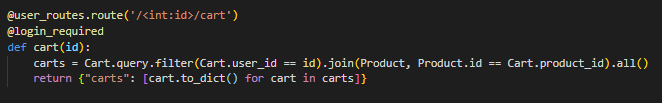

# Welcome to Hobbetsy!

### Hobbetsy is an app dedicated to making sure that all people in Middle-earth are equipped to face whatever life can throw at them. Be it a Balrog in the depths of Moria or you are a burglar on your first adventure we can get you equipped!

---
### Index

[Technologies](#Technologies)

[Key Features](#Key-Features)

[Visit Hobbetsy](https://hobbetsy.herokuapp.com/)

[Database Schema](https://github.com/jemcodes/hobbetsy/wiki/Database-Schema)

[Frontend Routes](https://github.com/jemcodes/hobbetsy/wiki/Front-End-Routes)

[API Routes](https://github.com/jemcodes/hobbetsy/wiki/API-Routes)

[Details](#Details)

[Feature Spotlight](#Feature-Spotlight)

[Code Snippets](#Code-Snippets)

[Hobbetsy Future Roadmap](#Hobbetsy-Future-Roadmap)

[Technical Instructions for Project](#Technical-Instructions-for-Project)

[Pre-Project Planning](#Pre-Project-Planning)

[Developers](#Developers)

[Special Thanks](#Special-Thanks)

---
### Technologies

* Python
* Flask
* JavaScript
* React-Redux
* JSX
* CSS
* SQLAlchemy
* PostgreSQL
* Heroku
* VSCode
* Docker
* npm
* Figma
* Adobe Photoshop
* Adobe XD
* DrawSql
* notion

### Key Features
* Product Listings
    - A user can view all products or a single product and add it to their cart.
* Comments/Reviews
    - A user can view the current reviews of a product, write a review on a product, update that review and delete a created review. 

### Details

>“If more of us valued food and cheer and song above hoarded gold, it would be a merrier world.” ― J. R. R. Tolkien*

Our Hobbetsy Full-Stack Project is a marketplace for heroes and adventurers to outfit themselves before heading out into the great beyond. We are in the business of the unexpected. Life can't hit you with something you're unprepared for if you are carrying Hobbetsy Gear. 

### Visit Hobbetsy
https://hobbetsy.herokuapp.com/

### Feature Spotlight
* Shopping Cart
    - Users can add products to their cart, remove products from their cart and checkout using their store tab. 
* Search
    - Users can search the product offerings on Hobbetsy and click the search result to view that individual product.

### Code Snippets
* User Cart Query

* Search 

### Hobbetsy Future Roadmap
- Categories
- Favorites
- Dual account user types. Customers and Sellers.
- Improve Checkout Process with User gold and product quantity updates.
- Full Text Search Functionality.

### Technical Instructions for Project
* Git Clone
* On local machine, run 'pipenv install' to install required dependencies.
* Create initial database user and database as stated in .env.example file.
* Enter your pip environment.
* In terminal flask run to start backend.
* In a separate terminal cd into the react app file. 
* Run npm start to start the front end server. 
* This should start new page in your browser. localhost:port in browser.

### Pre-Project Planning
* Picked and researched a clone and decided on general theme to distinguish
* Created model schema for database relations with DrawSQL
* Created a basic wire-frame using Figma.
* Looked for sites to supply data for product information.
* Developed a working protocol to track the course of project with notion 

### Developers
* Lisa Noor [Github](https://github.com/Skulllady) [Linkedin](https://www.linkedin.com/in/lisa-noor-hoque-976120208/) 
* Jamie Sullivan [Github](https://github.com/bilbopicard) [Linkedin](https://www.linkedin.com/in/sullivan-jamie/) 
* jane Martin [Github](https://github.com/jemcodes) [Linkedin](https://www.linkedin.com/in/jemcodes/) 
* Patrick Nusbaum [Github](https://github.com/patricknuttree) [Linkedin](https://www.linkedin.com/in/patrick-nusbaum-mpa) 

### Special Thanks
* Material Middle Earth - For supplying us with photos for the products on our site.
* DMHeros - For providing us a means of creating our awesome developer head-shots. 
* WoW head - For providing us with images for our bow products.
* Pixabay & Unsplash

<!-- This project was bootstrapped with [Create React App](https://github.com/facebook/create-react-app).

Your React App will live here.  While is development, run this application from this location using `npm start`.

No environment variables are needed to run this application in development, but be sure to set the REACT_APP_BASE_URL environment variable in heroku!

This app will be automatically built when you deploy to heroku, please see the `heroku-postbuild` script in your `express.js` applications `package.json` to see how this works. -->
